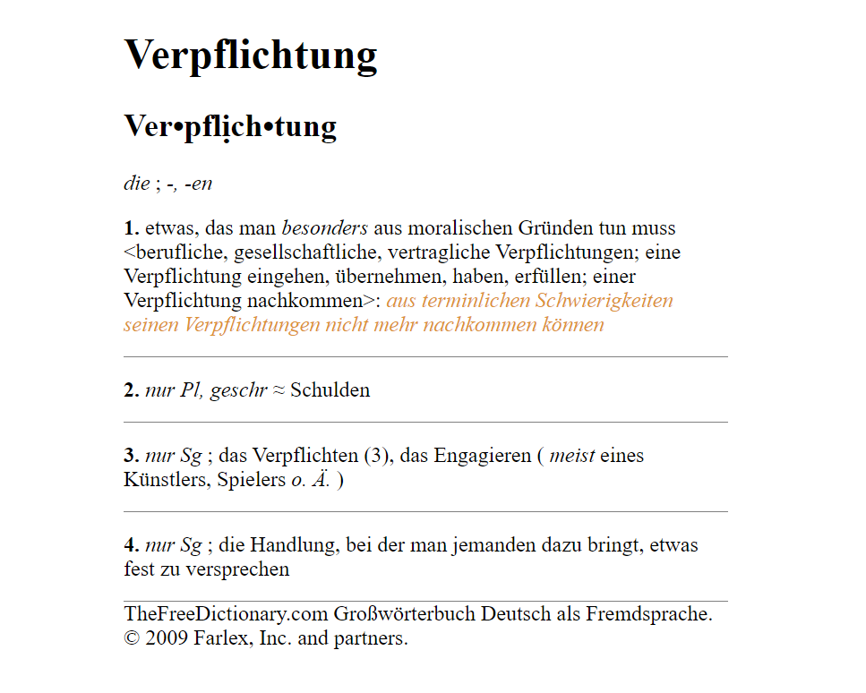

# Dictionary Search Hotkey

A Python script that allows you to search for definitions of German words using a hotkey combination and displays the results in a HTML page.

## Description

The "Dictionary Search Hotkey" script is a Python program that utilizes web scraping to retrieve word definitions from an online dictionary website (https://de.thefreedictionary.com/). It provides a convenient way to trigger the dictionary search using a customizable hotkey combination. The results are displayed in an HTML page, which is automatically opened in the default web browser. A personal project to learn Python with and create a useful application for my language learning needs. I would like to expand on the project, make it more customisable and possible integration with Anki for card creation.

## Features

- Define a hotkey combination to trigger the dictionary search.
- Scrape the dictionary website to retrieve word definitions.
- Generate an HTML page with the search results.
- Automatically open the HTML page in the default web browser.
- Supports customization of CSS styles for the HTML page.

## Installation

To run with fixed settings:
1. Download DictionarySearch.exe file from the output folder

To customise:
1. Clone the repository or download the script files.
2. Install the required Python libraries using the command: `pip install -r requirements.txt`.

## Usage

Basic - Executable file:
1. Run the AutoHotkey script by double clicking 'lookup.ahk'.
2. Copy a word to the clipboard.
3. Press CTRL+Shift+S to trigger the dictionary search.
4. The HTML page with the search results will be opened in the default web browser.

## Customization

- To customize the CSS styles for the HTML page, modify the `css_styles` variable in the `generate_html` function.
- Recompile with Pyinstaller or Auto-py-to-exe (GUI) under the same name and place in the output folder.
- Modify the hotkey combination in the 'lookup.ahk' file if desired, no recompile needed.

## Dependencies

- requests
- beautifulsoup4
- pyperclip
- webbrowser